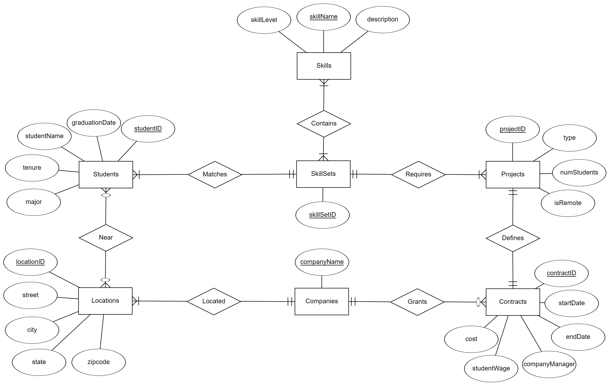
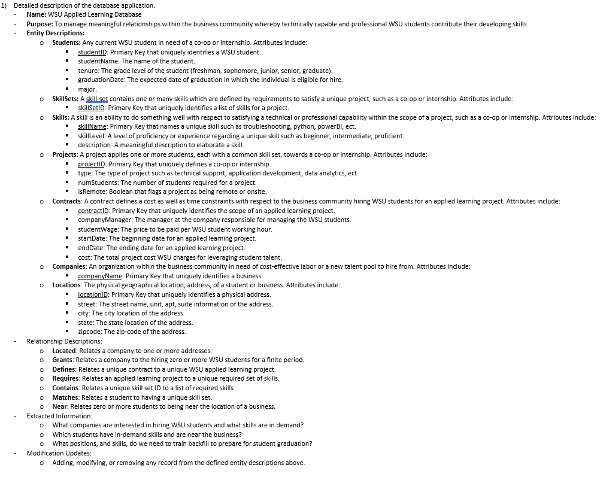
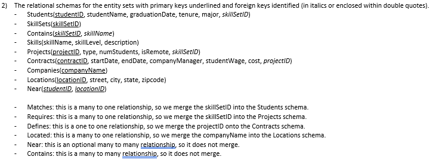

# WSU_ALDB
WSU Applied Learning Database
[](https://repl.it/github/WSUCS665/WSU_ALDB)


* This repository represents the Wichita State University Applied Learning database
* This repository is front-ended by [Repl.it](https://WSUALDB.wsucs665.repl.run)
* This repository supported by a serverless CICD build processes
* Flake8 linting, unittests, and coverage are enforced for quality.
* Compatible with Python 3.6.x, Windows, Linux, Mac


## CONTENTS
* [Documentation](#documentation)
* [ToDo](#todo)
* [Goals](#goals)
* [Instructions](#instructions)
* [Troubleshooting](#troubleshooting)

## Documentation
```javascript
The Entity Relationship Diagram and details for this repository are as follows.
```





## ToDo
```javascript
* Share the project with the team
* Add team mambers to the repository
* Design an implementation for the CS665 project
```


## Goals
```javascript
* What companies are interested in hiring WSU students and what skills are in demand?
* Which students have in-demand skills and are near the business?
* What positions, and skills, do we need to train backfill to prepare for student graduation?
```

## Instructions
```javascript
If you wish to download respository and execute main.py locally please install the following requirements

* Python3
```


## Troubleshooting
```javascript
All unittest files located in the unit_tests directory can be debugged using test_suite.py

Set your breakpoints anywhere in a unittest file located withn the unit_tests directory.
Then execute the test_suite.py file in debug mode (Visual Studio Code) to enter and step
into your breakpoints. For each new unittest file that is added into the unit_tests
directory, be sure to add the respective import within test_suite.py
```
